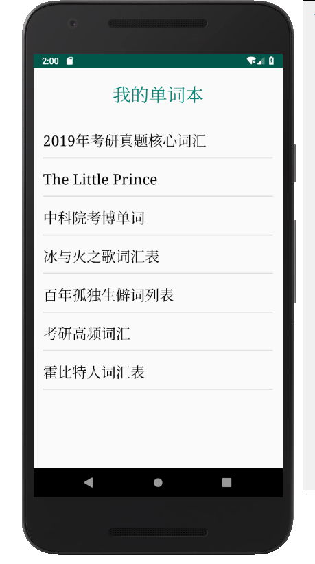
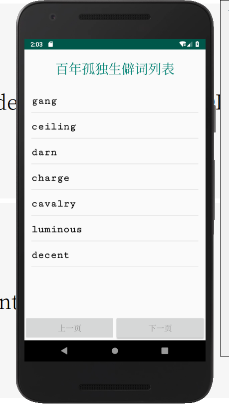
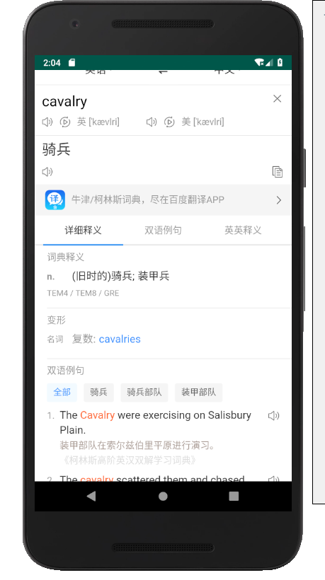
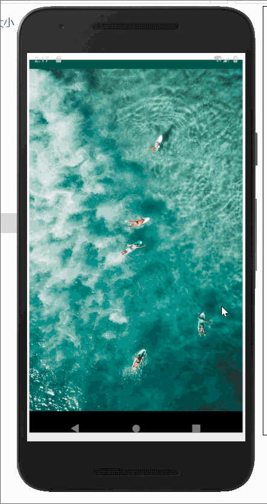

# Tuna软件说明

tuna-android-demo是一款依赖于[tuna](https://github.com/xkfx/tuna)作为服务端而运行的安卓端单词本&单词浏览软件。

在使用时需要自行进行tuna服务端的搭建。安卓端具有查看单词本列表/查看单词列表/查看单词详情等功能，而web端则可以进行单词本&单词的创建、删除、修改。

## 一、软件截图及功能详解

### a、查看单词本列表

该页面为APP首页，当打开该页时即向服务端发起请求，获取单词本列表并显示。

### b、查看单词列表

单词列表页每页显示7个单词，通过点击“上一页”和“下一页”按钮进行翻页。位于首页时无法点击“上一页”按钮，位于末页时无法点击“下一页”按钮。

### c、查看单词详情

通过调用百度翻译实现单词详情。

## 二、运行演示

